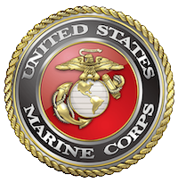
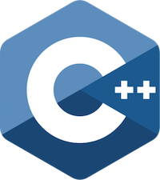

# 
Michael Gaskill

I'm an Entrepreneur, Technical Leader, Software Architect, and Software Engineer.  I like to be innovative, solve hard problems, crunch data, reach people, and build amazing products that people love to use.

## How I proudly identify
| Marine Corps Veteran | Rails Engineer | C++ Engineer | Entrepreneur | Comic Book Guy |
| --- | --- | --- | --- | --- |
|  |  |  |  |  |

## Find me here
* Website: [michaelgaskill.com](http://michaelgaskill.com)
* Github: [github.com/mgaskill](https://github.com/mgaskill)
* LinkedIn: [linkedin.com/in/mgaskill](https://www.linkedin.com/in/mgaskill)
* Stack Overflow: [stackoverflow.com/users/2577852/michael-gaskill](https://stackoverflow.com/users/2577852/michael-gaskill)
* CrunchBase: [crunchbase.com/person/michael-gaskill](https://www.crunchbase.com/person/michael-gaskill)
* AngelList: [angel.co/michael-gaskill](https://angel.co/michael-gaskill)
* Gandysoft: [gandysoft.com/about](https://gandysoft.com/about)
